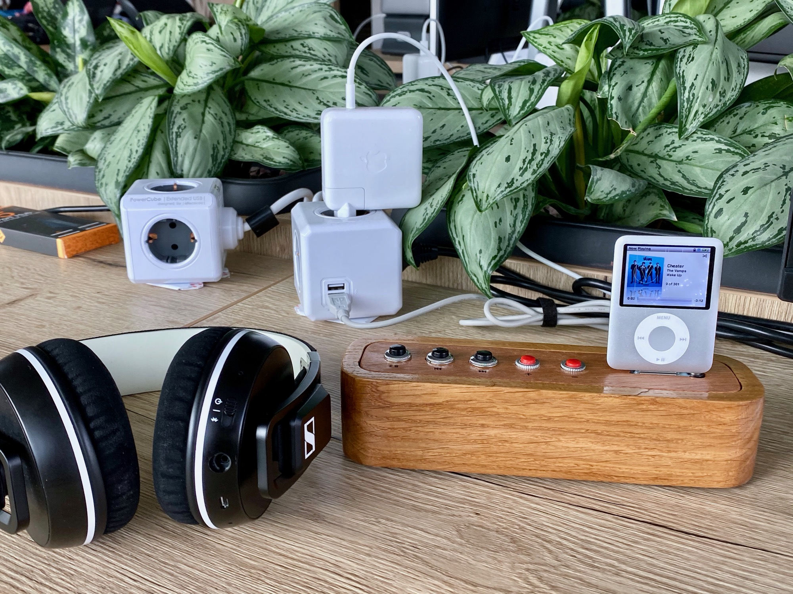
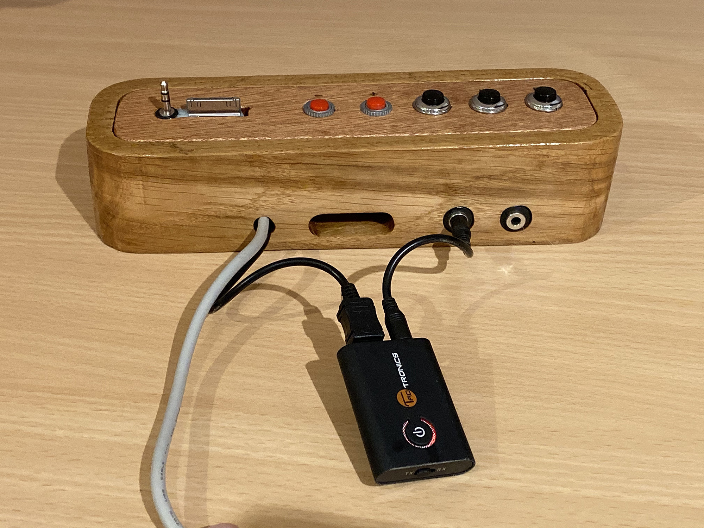
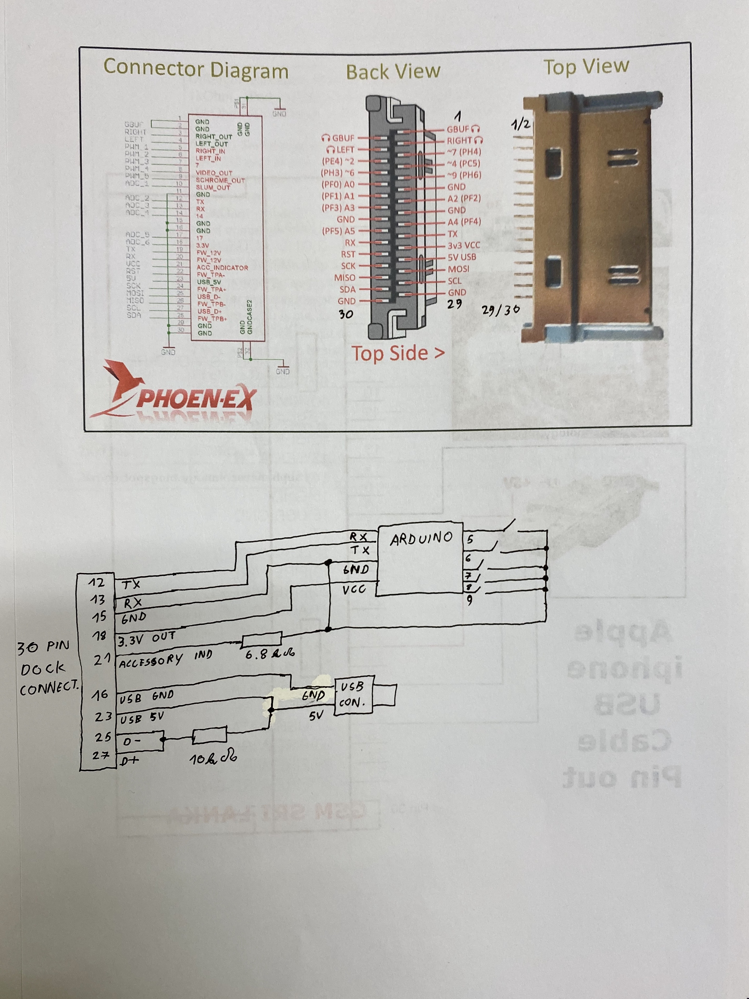

# Ipod dock

**A simple wooden iPod dock for retro ipod enthusiasts.**

## What is it?

It's a really simple (but beautiful) iPod dock designed to connect to old iPods (mainly Nanos) with Apple 30-pin iPod dock connector, and offers large buttons for controlling playback (play/pause, forward/back, volume up/down). It provides charging capabilities for your iPod and includes a headphone out and an optional Bluetooth transmitter to connect to your wireless Bluetooth headphones. Control of the iPod is achieved using an Arduino that uses serial lines present in the 30-pin connector to connect to the iPod and control it using Apple Accessory Protocol (AAP). 

## Building one yourself

### Electronics

The back of the dock shows you some of the "magic" here. To build the electronics you need very few parts listed here:

- Arduino Pro Mini (You will need the 3.3V version. I am using the 5V version, but the Atmega 328 isn't designed to run at 16MHz at 3.3V, so using the 3.3V board is a safer bet)
- 5 push buttons of your choosing (I am using 2 different kinds simply because I didn't have enough of one kind)
- male 30 pin Apple dock connector (the harderst part to find. There are some available on ebay, or you can get a cheap ipod acessory and get the connector from that. You can also try getting one from a cable.)
- A 3.5mm headphone Y splitter cable (or just a very short 3.5mm extension if you only want one audio jack)
- A USB cable to connect the dock to power (to charge your ipod)
- Two resistors (6.8k and 10k)
- Some thin wire (I recommend 30AWG single core wire meant for wire wrapping)
- A Bluetooth audio transmitter (optional)

The schematic (seen below) for this is very simple (as evident by the fact that it is drawn by hand). Basically you are connecting the TX/RX serial pins of the iPod to the Arduino, USB power pins to the iPod power pins, and you need one resistor to set the iPod into correct accessory mode and the other to charge the ipod. On the arduino side you just need to connect the push buttons. You will notice here that the 3.3V needed to power the arduino is provided by the iPod itself. So the charging part of the circutry is optional (but note that the Arduino will eat up the iPod battery fairly quickly without some software tweaks).

Note that the 30 pin dock connector can be difficult to solder to. The pins in these connectors should be removable, so you can pull out the pins that you don't need - which should make your life a little easier. 

Audio output is done via the 3.5mm headphone jack of the iPod. The dock connector only outputs line-level audio, which would require additional amplification so I decided to just use the 3.5mm jack to keep things simple. What I did is I took a small scrap PCB, glued the dock connector to it using epoxy (so that one row of pins is on one side of the PCB and the other row is on the other) and then glued a 3.5mm jack next to it (to the scrap PCB). I connected both things to my ipod before gluing them together to get a perfect fit. With this spacing the dock will fit iPod Nanos 1st, 2nd, 3rd (and probably 4th - not tested) generations. Ipod nano 5 and 6 have different connector spacings. I am not sure about iPod classics. The Bluetooth transmitter is a common thing available on amazon in various shapes and sizes. I've added a small micro USB out for easier charging (and connected it to the power pins of the USB connector), but that was just an afterthought.

Firmware is quite simple. It's a standard Arduino project with two libraries:
- https://github.com/finsprings/arduinaap
- https://github.com/thomasfredericks/Bounce2

I've included the versions that I've used in the Firware folder, so everything is easier to get up and running.

### Wooden enclosure

I will only describe this briefly since you probably can't build the same enclosure yourself...

I've made the enclosure using a CNC machine from two pieces of scrap wood. One very thick hard wood piece (for the main enclosure) and two small pieces of plywood (top and bottom panel). I've included both the premade gcode files (made for GRBL firmware) and the original files for Vectric Aspire. You will probably need to modify these to fit your components anyway. But if you want to use these - the panesl file includes top and bottom cover, body 1 file is the top of the hardwood piece, then you are supposed to flip the thing, and cut the body 2 piece. Flip the piece the third time and cut the back as well.

The top transport control labels were engraved using a cheap K40 laser cutter/engraver. I've included those files as well.

The whole thing is then screwed and glued together and I've added a thin coat of boat lacquer to make everything nicer.

If you don't have a CNC you could probably make something like this using a handheld router, although the main piece of wood may be too thick for that.  

## Help and support

If you need help with anything contact me either through github (open an issue here), or through Hackaday.io https://hackaday.io/project/169241-ipod-dock . You can also check my website: http://www.r00li.com .

## License

This project is Licensed using GNU GPL Version 3. See LICENSE for more details.
